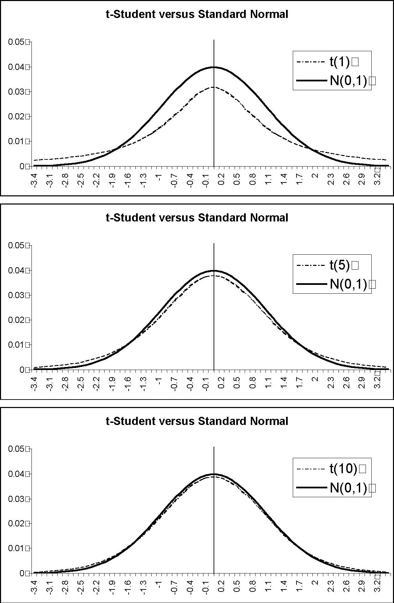

0-3.4-3.1-2.8-2.5-2.2-1.9-1.6-1.3-1-0.7-0.4-0.10.20.50.81.11.41.722.32.62.93.2N(0-3.4-3.1-2.8-2.5-2.2-1.9-1.6-1.3-1-0.7-0.4-0.10.20.50.81.11.41.722.32.62.93.2N(0-3.4-3.1-2.8-2.5-2.2-1.9-1.6-1.3-1-0.7-0.4-0.10.20.50.81.11.41.722.32.62.93.2N(t-Student versus Standard Normal 0.010.020.030.040.05t(1)0,1)t-Student versus Standard Normal 0.010.020.030.040.05t(5)0,1)t-Student versus Standard Normal 0.010.020.030.040.05t(10)0,1)
