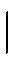

         2006-10-09T22:51:13-05:00

          TeX output 2006.10.09:2251

         2006-10-20T18:30:40-04:00

         2006-10-20T18:30:40-04:00

         dvipdfm 0.13.2c, Copyright © 1998, by Mark A. Wicks

         xml

         uuid:796aab4d-b791-4f66-82e2-6aac260cd481

         uuid:2acce24a-6b51-4909-b72d-8e9e00576fc8

Lecture Note 10 ∗Hypothesis Testing

### MIT 14.30 Spring 2006Herman Bennett

Hypothesis testing: Given a random sample from a certain population, Is the sample evidence enough to disregard a particular belief about that population? (E.g.: the value of a parameter.) 

## 25 Definitions 

### 25.1 Hypothesis Testing 

A (parametric) hypothesis is a statement about one or more population parameters 1 . This hypothesis can be tested using a hypothesis test. 

A hypothesis test consists of: 

- Two complementary hypotheses: the null hypothesis and the alternative hypothesis, denoted H0 and H1 respectively. 
- A decision rule that specifies for which sample values the null hypothesis is not rejected (‘accepted’), and for which sample values the null hypothesis is rejected in favor of the alternative hypothesis. 

The set of sample values for which H0 is rejected is called the rejection or critical region. The complement of the critical region is called the acceptance region (where H0 is accepted). 

∗Caution: These notes are not necessarily self-explanatory notes. They are to be used as a complement to (and not as a substitute for) the lectures. 1An example of a nonparametric hypothesis would be to make a statement about the distribution of the RV X. E.g.: X ∼ N( ). 

A hypothesis that if true completely specifies the population distribution, is called a simple hypothesis; one that does not is called a composite hypothesis. 

### 25.2 General Setting for Hypothesis Testing 

Let X1, ..., Xn be a random sample from a population with pmf/pdf f(xθ). Define the 

|

following hypothesis test about the parameter θ ∈ Ω,: 

H0 : θ ∈ Ω0H1 : θ ∈ Ω1,

where Ω0 ∪ Ω1 = Ω and Ω0 ∩ Ω1 = ∅. H0 is rejected if the random sample X1, ..., Xn lies in the n−dimensional space C. The space C is the critical region defined in terms of x, the n−dimensional vector that contains the random sample. 

The two complementary hypotheses, H0 and H1, usually take one of the following five structures: 

1.-Singleton H0 and singleton H1 :	H0 : θ = θ0 H1 : θ = θ1 (76) 

2.-Singleton H0 and composite 2-sided H1 :	H0 : θ = θ0 H1 : θ = θ0 (77) 

3.-Singleton H0 and composite 1-sided H1 :	H0 : θ = θ0 

H1 : θ&lt;θ0 (or θ&gt;θ0) (78) 

4.-Composite 1-sided H0 and composite 1-sided H1 : H0 : θ ≤ θ0 (or θ ≥ θ0) 

H1 : θ&gt;θ0 (or θ&lt;θ0) (79) 

5.-Composite 2-sidedH0 and composite 2-sided H1 : H0 : θn1 ≤ θ ≤ θn2 

H1 : θ&lt;θn1 and θ&gt;θn2 (80) 

### 25.3 Type of Errors in Hypothesis Testing 

A type I error occurs when H0 is rejected when indeed is true. The probability that this error occurs, denoted αθ, is defined as follows: 

αθ = P (type I error) = P �rejecting H0

��

θ ∈ Ω0� (81) 

A type II error occurs when H0 is not rejected when indeed H1 is true. The probability that this error occurs, denoted βθ, is defined as follows: 

βθ = P (type II error) = P �accepting H0

��

θ ∈ Ω1� (82) 

• Wrap up: 

#### 25.3.1 Level of Significance and Optimal Tests 

The level of significance, or size, of a hypothesis test is the highest type I error. The level of significance is denoted by α. 2 Formally: 

α = sup αθ. (83) 

θ∈Ω0 

If Ω0 is singleton: α = αθ. 

For a given pair of null and alternative hypotheses, and a given level of α, an optimal hypothesis test is defined as a test that minimizes βθ ∀θ. Note that optimal tests do not exist for many hypothesis test structures (more on this later). 

2There is a technical difference between the level and the size, which in practice becomes only relevant in complicated testing situations. For the purpose of this course we will use them interchangeably. 

Example 25.1. Assume a random sample of size n from a normal population N(µ, 4). ¯

i) Use the statistic X to construct a hypothesis test with H0 : µ = 0, H1 : µ = 1, and a decision rule of the form “reject H0 when x&gt;k”, such that the probability of type I 

¯error is 5%. ii) Compute the probability of type II error. What is the size of the test? iii) What happens to α and β as k or k ? Which is the trade-off? iv) What happens if the 

↑↓

sample size n increases? v) How would the answers change if we redefine the hypotheses as H0 : µ = 0 and H1 : µ =0. 

• Be careful when interpreting the results of a hypothesis test: accepting v/s failing to reject H0. 

### 25.4 Power Function 

Let’s denote the characteristics of a hypothesis test (the null hypothesis, the alternative hypothesis, and the decision rule) by the letter δ. 

The power function of a hypothesis test δ is the probability of rejecting H0 given that the true value of the parameter is θ ∈ Ω. 

π(θ|δ)= P �rejecting H0

��

θ ∈ Ω� = P (X ∈ C|θ) for all θ ∈ Ω. (84) 

Thus, 

π(θ|δ)= αθ(δ) if θ ∈ Ω0 1 − π(θ|δ)= βθ(δ) if θ ∈ Ω1 (85) 

Example 25.2. Ideal power function...a=? b=? 

� a if θ ∈ Ω0

π(θδ)=|b if θ ∈ Ω1. 

- If Ω0 is singleton: α = π(θ|δ). 
- For a given pair of null and alternative hypotheses, and a given level of α, an optimal hypothesis test, δ∗, is a test that minimizes β(δ) for all θ ∈ Ω1. In other words, δ∗ maximizes the power function for all θ ∈ Ω1. 

Example 25.3. Assume a random sample of size n from a U[0,θ], where θ is unknown. Suppose the following hypothesis test δ: 

H0 :3 ≤ θ ≤ 4 H1 : θ&lt; 3 or θ&gt; 4 

Decision rule: Accept H0 if θˆMLE ∈ [2.9, 4.1], and reject H0 otherwise. 

Find the power function π(θ|δ) (note: ∀θ). Which is the size of this test? 

### 25.5 p-value 

The p-value describes the minimum level of significance α that would have implied, given the particular realization of the random sample (x), a rejection of H0. Thus, the p-value, as well as whether H0 is rejected or not, are ex-post calculations. 

## 26 (Four) Most Common Hypothesis Tests Structures 

### 26.1 Likelihood Ratio Test (LRT): 

H0 : θ = θ0 

H1 : θ = θ1 

Decision Rule form: “Reject H0 if f1(x)/f0(x) &gt;k”. (86) 

Where k&gt; 0 is a constant chosen according to the size of the test (α0), such that P (f1(x)/f0(x) &gt;kθ0)= α0. The statistic f1(x)/f0(x) is given by: 

|

fi(x)= f(x1,x2, ..., xnθi)= f(x1θi)f(x2θi)...f(xnθi)(iid sample) (87)

||||

• The ratio f1(x)/f0(x) is called the likelihood ratio of the sample. 

Optimality of the LRT 

Minimize the probability of type II error given the probability of type I error: 

min β ; given α0. 

δ 

(α0 is the size imposed on the test.) 

(Neyman-Pearson lemma) Let δ∗ be a hypothesis test where H0 and H1 are simple hypotheses, and where H0 is accepted if kf0(x) &gt;f1(x)(k&gt; 0). Otherwise, H1 is accepted, except if kf0(x)= f1(x) where both H0 and H1 may be accepted. Then, for every other hypothesis test δ: 

β(δ) &lt;β(δ∗) α(δ) &gt;α(δ∗) (88)

←→ 

8 

Example 26.1. Assume a random sample of size n = 20 from a Bernoulli distribution, where p is unknown. Suppose the following hypotheses: 

H0 : p =0.2 H1 : p =0.4 

Find the optimal test procedure δ∗ with α(δ∗)=0.05. 

• For the case of a normal random sample, the hypothesis test (86) implies the following decision rule: 

-“Reject H0 if ¯x&gt;k� ” when θ1 &gt;θ0. 

-“Reject H0 if ¯x&lt;k� ” when θ1 &lt;θ0. 

(For the derivation of this result check DeGroot and Schervish (2002) page 465.) 

### 26.2 One-sided Test: 

H0 : µ = µ0 H1 : µ&gt;µ0 or H1 : µ&lt;µ0 

Decision Rule form: “Reject H0 if ¯x&gt;c” or “Reject H0 if ¯x&lt;c”. (89) 

Where c is a constant chosen according to the size of the test (α0), such that P (¯µ0)= α0

X&gt;c

|

or P (¯µ0)= α0.

X&lt;c

|

Optimality of One-sided tests 

What does it mean to be optimal in these cases? Should we use non optimal tests? 

A generalization of the relevant optimality results for these cases is out of the scope of this course. 3 However, we can handily state the following result: 

-Assume a random sample from a binomial or normal distribution, a null and an alternative hypotheses given by (89), and a level of significance α0. Then, the optimal test δ∗, which minimizes β(δ) for all θ ∈ Ω1, is given by test (89). 

• The decision rule of test (89) is widely used for cases (78) and (79), even if it is not an optimal test. 

3An excellent reference is DeGroot and Schervish (2002) Ch. 8.3. 

Example 26.2. Assume a random sample of size n = 100 from a N(µ, 1), where µ is unknown and ¯x =1.13. Suppose the following hypotheses: 

H0 : µ =1 H1 : µ&gt; 1 

Construct a one-sided hypothesis test of size 0.05. Test the null hypothesis and find the p-value. 

### 26.3 Two-sided Test: 

H0 : µ = µ0H1 : µ = µ0

Decision Rule form: “Reject H0 if ¯x is outside the interval [c1,c2]. (90) 

Where c1 and c2 are a constants chosen according to the size of the test (α0), such that P (¯x/∈ [c1,c2] |µ0)= α0. Usually, hypothesis tests are constructed in a symmetric way, which means that P (¯µ0)= α0/2 and P (¯µ0)= α0/2.

X&lt;c1X&gt;c2

||

Optimality of Two-sided tests 

Unfortunately, there is no robust result regarding optimality in this case. No test procedure δ∗ will minimize βθ(δ) for all θ ∈ Ω1. However, the optimality results for the 1-sided hypothesis test case suggest that a reasonable decision rule for the hypotheses described in (90), could be given by the decision rule of test (90). 4 

• The decision rule of test (90) is widely used for cases (77) and (80). 

Example 26.3. A candle producer company claims that their candles last for 60 minutes on average. One consumer, curious about this claim, bought 40 candles and tested them. He found that on average they last for 65.22 minutes. With the data collected he also computed the statistic s2 = 225. Can the consumer say, with 99% of significance, that the company is wrong in its claim? (Assume the sample is iid.) Also, compute the p-value and the limiting n such that H0 is rejected at α =0.01 (assume s2 and ¯x keep their value). 

4In fact, this is what most researchers do. 

### 26.4 Generalized Likelihood Ratio Test (GLRT): 

H0 and H1 : any composite or simple hypothesis 

Decision Rule form: “Reject H0 if W &gt;k”. (91) 

Where k&gt; 0 is a constant chosen according to the size of the test (α0), such that P (W &gt;kH0)= α0. The statistic W is given by: 

|

W = supθ∈Ω1 L(θ1, ..., θk|x1, ..., xn) = supθ∈Ω1 f(x|θ ∈ Ω1) . (92) supθ∈Ω0 L(θ1, ..., θk|x1, ..., xn) supθ∈Ω0 f(x|θ ∈ Ω0) 

• As with previous tests, the constant k will depend on the distribution of the statistic W and α0. If computing the distribution of W becomes a nightmare, it is possible to use an equivalent definition of the GLRT, (93), which has a known limiting distribution. 

T = supθ∈Ω0 L(θ1, ..., θk|x1, ..., xn) = supθ∈Ω0 f(x|θ ∈ Ω0) (93) supθ∈Ω L(θ1, ..., θk|x1, ..., xn) supθ∈Ω f(x|θ ∈ Ω) 

Decision Rule form: “Reject H0 if T &lt;d”; where d&gt; 0 is a constant chosen according to the test size (α0), such that P (T &lt;d|H0)= α0. The limiting distribution of −2lnT is known: 

−2lnT n→∞χ2 (94)∼ (r) ; where r is the # of free parameters in Ω minus the # of free parameters in Ω0. Reject H0 if −2lnT &gt;χ25 

(r),α. 

If it is possible to compute directly the distribution of W or T , then it is better to use that distribution instead of the limiting χ2 . 

Optimality of GLRT 

The GLRT is a generalization of the LRT; it works for any case where either H0 or/and H1 are composite hypotheses. However, GLRT is not necessarily optimal, as the LRT is. In particular, it will depend on the case at hand (further details on this issue are out of the scope of this course 6). 

5The technical result says that the distribution is a χ2 with degrees of freedom r = dimΩ − dimΩ0.

(r)6An excellent reference is DeGroot and Schervish (2002) Ch. 8.

## 27 Hypothesis Testing Based on Two Normal Samples 

Example 27.1. Assume 2 random samples: Xi ∼ N(µX ,σ2 ) of sample size nX

X Yi ∼ N(µY ,σ2 ) of sample size nY ,

Y 

and the following hypotheses to be tested: a) H0 := µY b) H0 : σ2 = σ2 

µX XY σ2 = σ2

H1 : µX =�µY H1 : X �Y 

For each case, construct a hypothesis test of size 95%. In part a) assume that you know σ2 and σ2 

XY . 

That’s all Folks!
