         Acrobat Distiller 7.0 (Windows)

         微软中国

         D:20071118131935

         Acrobat PDFMaker 7.0 for Word

         2007-11-18T21:21:26+08:00

         2007-11-18T21:20:20+08:00

         2007-11-18T21:21:26+08:00

         uuid:64ed9ec9-1f54-491f-af11-7099d4f7dd6a

         uuid:af1821be-2f1b-4fa3-80e6-06e9a5ffdcb2

               26

         xml

               第十章

               猪猪猫.CN

 第10讲* 
   假设检验 
麻省理工学院 14.30 2006年春季 
Herman Bennett 
假设检验：给定来自某一总体中的一个随机样本，这一样本是否足以否定对总体的某种猜想。（例如：参数的值） 

25 定义 

25.1 假设检验 

一个(参数)假设是对一个或多个总体参数的一种命题陈述。

1

 该假设可以通过假设检验来验证。 
一个假设检验包括： 

- 1. 两个互补假设：原假设和备择假设，分别记作和。 

0H

1H

- 2. 决策规则为指出对哪些样本值不拒绝（“接受”）原假设，对哪些样本值拒绝原假设而接受备择假设。 

0H

被拒绝的样本数值的集合被称作拒绝域或判别域。判别域以外的区域被称作接受域(被接受)。 

0H

注意：这些讲义不一定是自封的。它们只是对讲座的一种补充而不是替代。 
1非参数假设的例子应该是对随机变量X分布的一种命题陈述，例如：X～N()。 

2水平和大小之间存在一个技术差别，实践中，仅在复杂检验才细分。本课程中，我们设定两者可交换使用。 

3 最好参见DeGroot and Schervish (2002)第八章中8.3节部分。 

4 实际上，这正是许多学者研究的问题。 

5 技术结果表明该分布是一个

2()rχ

分布，自由度

0dimdimr=Ω−Ω

。 

6 最好参见DeGroot and Schervish(2002)第8章。 

构造一个假设就能够真正完整地确定总体分布，称为简单假设；否则，称为复合假设。 
25.2 假设检验的一般形式 

1nXX,...,

是一个总体概率密度函数为

(fxθ

的随机样本。定义对于参数θ∈Ω，进行的假设检验为： 

0Hθ∈Ω：

1Hθ∉Ω：

其中，。如果随机样本

0101Ω∪Ω=ΩΩ∩Ω=∅和

1nXX,...,

落在n维空间C中，则拒绝。空间是对X而言的一个判别区域，X是包含随机样本的n维向量。 

0H

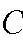

C

两个互补假设和通常表现为下面五种形式： 

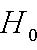

0H

1H

- 1. 简单原假设和简单备择假设：   ：

0H

1H

0H

0θθ=

1H

：

1θθ=

                 (76) 
- 2. 简单原假设和复合双侧备择假设：：

0H

1H

0H

0θθ=

1H

： 

1θθ≠

              （77） 
- 3. 简单原假设和简单备择假设： ：

0H

1H

0H

0θθ=

1H

：

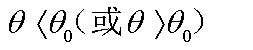

0θθθθ〈〉（或）

            (78) 
- 4. 复合单侧原假设及复合单侧备择假设：：

0H

1H

0H

00θθθθ≤≥（或）

1H

：

0θθθθ〉（或）

    (79) 
- 5. 复合双侧原假设和复合双侧备择假设：：

0H

1H

0H

θθθ≤≤12nn

1H

：

θθθθ〈〉1n且

     (80) 

25.3 假设检验的错误类型 

当为真却拒绝时发生

0H

0H

第一类错误，该错误发生的概率记作

θα

，定义如下： 

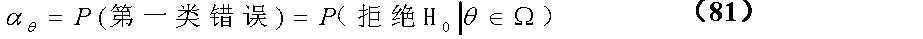

()PPθαθ==0第一类错误（拒绝H）

        （81） 
当为真时却接受H

1H

0时发生第二类错误，该错误发生的概率记作

θβ

，定义如下： 

()PPθβθ==0第二类错误（接受H）

             （82） 

-  总结： 

25.3.1 显著性水平及最优检验 

假设检验的显著性水平（或大小）是指发生犯第一类错误的最大概率。显著性水平记作

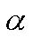

α

2

                      (83) 
如果是独点集，则

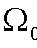

0Ω

θαα=

。 
对于给定的一组原假设和备择假设，在给定的显著性水平下，最优假设检验定义为对于任意θ，使

θβ

最小化的检验。注意，很多假设检验并不存在最优检验（以后再详讲）。 
例25.1 假设一个来自

Nμ（，4）

总体的容量为n的随机样本，（1）运用统计量

X

建立一个假设检验，

00Hμ=：

，

11Hμ=：

，而且决策规则为“

0Xk〉当时拒绝

”。这样犯第一类错误的概率为5%。（2）计算犯第二类错误的概率。检验的置信水平是多少？（3）当k变大或者变少时，α和β会有什么变化？如何进行两者的权衡？（4）如果样本容量n增加又会如何？（5）如果我们重新设定假设

00Hμ=：

，

10Hμ≠：

结果会有什么变化？ 

-  解释假设检验的结果时要注意：接受与不拒绝的区别。 

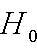

0H

25.4 功效函数 

用字母δ来表示假设检验（原假设，备择假设及决策规则）的特征。 
假设检验δ的功效函数是指已知参数的真实值为θ∈Ω，拒绝的概率。 

0H

Pθπθδθθθ=∈Ω∈0（）（拒绝H）=P（XC），对于所有的

    (84) 
因此， 

0θθπθδαθ=∈（），如果

11θθπθδβθ−=∈（），如果

                        (85) 
例25.2. 理想的功效函数… 

?a=，b=?

如果θ∈Ω0
如果θ∈Ω1  
如果Ω0 是独点集，那么

απθδ=（）

。 
对于给定的一对原假设和备择假设，给定的显著性水平α，最优的假设检验δ*是指对于所有

1θ∈Ω

使β(δ)最小的检验。换句话说，对于所有的

1θ∈Ω

，δ* 使功效函数最大。 
例25.3. 设一个来自总体

[]0,

U容量为n的随机样本，θ未知，设定下列假设检验δ： 

0H

：

34θ≤≤）

1H

：

34θθ〈〉或）

决策规则：如果

，接受，否则拒绝。计算功效函数

0H

0H

πθδ（）

 (注：

)。检验的显著性水平为多少? 

25.5  

p−值法

   是描述给定的随机样本得到数值实现，拒绝时，显著性水平

p−值

0H

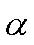

α

的最小值。 
因此，无论被拒绝或者被接受，

0H

p−值

是后验计算法。 
26  （四个）最常用的假设检验框架 
26.1 似然比检验(LRT): 

00Hθ=：

11Hθ=：

决策规则：“如果，则拒绝 ”               （86） 

10ff〉(x)/(x)k

0H

其中，根据检验的显著性水平(

0α

)的大小选取常数k&gt;0。因此，

10(Pffθα〉0(x)/(x)k)=

。统计量

10ff(x)/(x)

1是根据如下表达式给定： 

1212(,,...,)()()...(iniiiffxxxfxfxfxθθθ=(x)=)

（独立同分布样本） （87） 

10ff(x)/(x)

- 的比率被称为样本的似然比统计量。 

似然比检验的最优性 

给定犯第一类错误的概率而使犯第二类错误的概率最小。 

min;δβα   0给定

(

α0

是检验设定的显著性水平) 
(奈曼-皮尔逊引理) 设

*δ

是一个假设检验，其中和为简单假设，如果，接受；否则，接受

0H

1H

01kff〉(x)(x) (k0)

0H

1H

。，此外，时和都被接受。那么，对于任意一个其他的假设检验

01kff(x)=(x)

0H

1H

δ

： 

*)()(*)βδβδαδαδ〈↔〉()(

                      （88） 
 例 26.1. 设一个来自总体服从二项分布，容量为20的随机样本，

p

未知。设定的假设如下：                 ：

0H

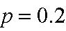

0.2p=

1H

：

0.4p=

计算最优的检验过程

*δ

，使

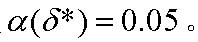

(*)0.05αδ=

。 

-  在正态随机样本的情况下，假设检验式(86)意味着如下的决策规则： 
—

12θθ′〉〉0当时，如果xk,则“拒绝 H

”。 
—

12θθ′〈〈0当时，如果xk,则“拒绝 H

”。 
(此结果引自DeGroot and Schervish (2002) 第465页) 

26.2 单侧检验: 

00Hμμ=：

1010HHμμμ〉： 或 ：

决策规则：

c〉0“如果x,则拒绝 H

或

c〈0“如果x,则拒绝 H

。（   （89） 
其中，根据检验的显著性水平（

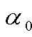

0α

)的大小选取常数。 

c

因此，

0()PXcμα〉=0

 或者

0()PXcμα〈=0

。 

单侧检验的最优性 

在这些例子中，什么意味着“最优”？如果我们使用非最优检验呢？ 
对这些例子中相应的最优结果的广义推导已经超出了本课程的范围

3

。然而，我们可以简单阐述以下结论： 
— 设服从二项分布或正态分布的一个随机样本，式(89)给定的原假设和备择假设，显著性水平为

0α

。那么，对于所有

1θ∈Ω

，使

()βδ

最小的最优检验

*δ

可以由式(89) 检验得出。 
式(89)的决策规则也适用于式（78）和式（79），即使它不一定是最优检验。 
例26.2设一个来自总体

(,1)Nμ

的容量为100的随机样本。

μ

未知，

1.13x=

。 
进行如下假设： 

0:1Hμ  =

0:1Hμ  〉

    构造一个显著性水平为0.05的单侧假设检验。验证原假设并计算p-值。 

26.3 双侧检验：

0010::HHμμμμ  =≠

决策规则为：

[]2,,c∉1“如果xc则拒绝”

                   (90) 
根据检验的显著性水平（

0α

)的大小选取常数。因此，

1cc，

[]12()Pxccμα∉=0，

。通常，假设检验是以对称的方式构造，表示为

10()PXcμα〈=0

 和 

20()PXcμα〉=0

。 

双侧检验的最优性 

令人遗憾的是，这些例子中关于最优检验没有得出一个稳健的结果。对于所有

1θ∈Ω

，没有使

()θβδ

最小的最优检验过程

*δ

4

式(90)的决策规则也适用于式 (77)和式(80)。 
例26.3一个蜡烛厂商声宣称他们的蜡烛平均可以持续燃烧60分钟。一个对此声明表示怀疑的消费者买了40根蜡烛，并作了试验。他发现蜡烛平均可以持续燃烧65.22分钟。根据搜集的数据，他计算了统计量s2=225。此消费者能够以99%的显著性水平，断定该厂商的声明是错误的吗？（假设样本是独立同分布）另外，再计算

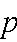

p

-值以及在显著性水平为

0.01α=

时，拒绝的极限。（假定s

0H

n

2和

的值保持不变） 

26.4 广义似然比检验（GLRT)： 

0H

和：任意复合假设或简单假设 

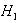

1H

决策规则表达形式为：            （91）  

0WKH〉“如果，则拒绝”

根据检验的显著性水平（

0α

)的大小选取常数。因此，

0k〉

0()PWkHα〉=0

。统计量W由下式确定： 

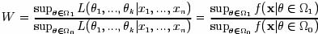

    （92） 

-  与前面的检验一样，常数k取决于统计量W的分布和

0α

   （93） 
决策规则表达形式为：

0H〈“如果Td，则拒绝”

。根据检验的显著性水平（

0α

)的大小选取常数。因此，

0d〉

0()PTdHα〈=0

。

2lnT−

 的极限分布已知为： 

                                      （94） 
其中，。如果

0rΩΩ等于中的自由参数#减掉中的自由参数#

22lnTαχ−〉（r）,

，。 

0H则拒绝

如果能够直接计算 W 或T的分布，那么最好用该分布代替极限

2χ

分布。 

广义似然比的最优性 

广义似然比检验是极大似然比检验的推广形式；在或/和为复合假设时应用该方

0H

1H

6

）。 

27 两个正态样本的假设检验 

例27.1假设两个随机样本： 

2(,)iXXXNμσ∼X，样本容量为n

2(,)iYYYNμσ∼Y，样本容量为n

做如下假设： 
(a)  

01::XYXYHHμμμμ  = ≠

            (b) 

220221::XYXYHHσσσσ  = ≠

对每种情况构造一个显著性水平为95%的假设检验。在（a）部分假定已知

2Xσ 

 和

2Yσ 

。 
谢谢大家！ 
