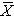
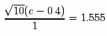
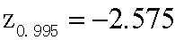
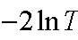

# 0 (四个)最常用的假设检验：应用复习 

我们针对同一个随机样本的应用，来复习一下四个最常用的假设检验框架。对每种检验，我们需要变换所做的假设和决策规则。 

## 0.1随机样本 

设为总体服从正态分布的一个随机样本，均值(μ)未知，标准差已知(σ=1)。下面的表格代表了随机样本的实现值： 

## 0.2似然比检验 (LRT): 

用显著性水平为5%进行似然比检验，原假设是总体均值为0，备择假设是为总体均值为1。 

决策规则的表达式为： “如果，则拒绝 ”  。 

- 我们需要计算k 和对于时，的值。k的值取决于我们想要构造的检验的显著性水平，的值取决于随机样本的实现值。 

## 0.2.1计算 k 

为了计算k，我们需要先知道原假设中的分布。注意大写字母X说明统计量是一个由随机样本中的随机变量函数构造的随机变量。 

计算分布的方法取决于（具体例子）假定的总体分布，往往很难计算。一旦知道了的分布，我们就可以寻找满足显著性水平条件的k值： 

DeGroot and Schervish(2002，第465页第八章)中提出一种不一定要知道的分布就能计算k的方法。运用这种方法我们计算出k=1.22，这意味着。大家课后可详见DeGroot and Schervish书中的叙述。（不是考试必读部分） 

## 0.2.2 计算似然比

计算

计算

## 0.2.3检验的结果 

，所以，在显著性水平为5%下，拒绝总体均值为0的原假设，接受总体均值为1的备择假设。 

## 0.3单侧检验: 

用显著性水平为6%的单侧检验，检验原假设为总体均值为0.4，备择假设为总体均值大于0.4。 

决策规则的表达式为：“
”。 

*我们需要计算c值，它取决于我们想要构造的假设检验的显著性水平。 *

## 0.3.1计算 c 

我们要找到满足犯第一类错误的概率为6%这一条件的值， 

要计算，我们首先需要知道随机变量的分布。随机样本是正态分布，因此，可得  
。那么在原假设中， ，所以， 

因为  我们知道 

因为  可得

因此， 

## 0.3.2 检验的结果 

，所以，在显著性水平为6%下，不能拒绝总体均值为0.4的原假设，总体均值大于0.4的备择假设。 

## 0.4 双侧检验: 

在显著性水平为1%下，采用对称的双侧检验，检验总体均值等于0.1的原假设和总体均值不等于0.1的备择假设。 

决策规则的表达形式为：“如果

&lt;c1或

&gt;c2 ，拒绝H0”。 

-  需要计算c1和c2，它们的值取决于检验的显著性水平。 

0.4.1 计算 c1 和 c2 

我们需要找到满足犯第一类错误概率为1%这一条件的c1和c2的值。 

因为我们构造的是一个对称的检验，需要满足如下两个条件： 
P（

&lt;c1|μ=0.1）=0.005  和P（

&gt;c2|μ=0.1）=0.005 
为了计算c1和c2，我们需要知道随机变量

X

的分布。随机样本是正态的，则可知

，在原假设中，

，因此： 

且

  因为

，可得： 

以及

因为 和，在这里，和，可得： 

()0.005PZ〈=0.005  z

()0.005PZ〉=0.995  z

2.575=−0.005z

2.575=−0.995z

和

解得： 

和

-  注意，计算c2可以遵循上述单侧检验中计算c的步骤。（

0.005α=

- ） 

0.4.2 检验结果 

10.540.7140.540.914xcxc=〉=−=〈=和

，则显著性水平为1%时不能够拒绝总体均值等于0.1的原假设而去接受总体均值不为0.1的备择假设。 

0.5广义似然比检验（GLRT)： 

我们并不是求解这个检验，而是给出基本的指导： 

01:0:0HHμμ = ≠

      决策规则表达式为：。 

0H〉“如果Td，则拒绝”

T为如下统计量： 

-  我们需要计算T 和 d.。对于T ，就要找到似然函数的最大值（给定样本数据），通过在原假设和备择假设的集（此时

- ）中的所有可能的值估计μ。这个似然函数的最大值为从分母中得到的那个数值。 
-  我们需要遵循相同的步骤来计算分子中的数值，但是，只需要在原假设空间内估计μ所有可能值的似然数。因为在这种情况下，原假设空间是一个简单原假设，所以必须在μ=0处估计似然数。 
-  我们根据条件，

0)PTdμα〈==（

，计算。与似然比检验一样，计算T的分布方法因情况不同而异，很多时候很难计算。当计算广义似然比检验时，我们采用另一种方法。这种方法只应用于假设n→∞的情况下。在一个大样本中，我们知道

d

2lnT−

- 的极限分布（这一结果本课程不予证明）如下： 

其中，

0rΩΩ等于中的自由参数#减掉中的自由参数#

1

-  如果

22lnTαχ−〉（r）,

，。 

0H则拒绝

1技术结果表明该分布是一个

2()rχ

分布，自由度

0dimdimr=Ω−Ω

。 
