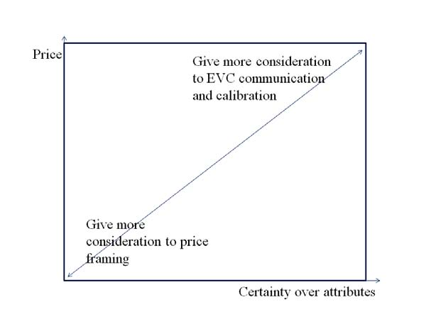

# PRICING UNDER CONSUMER UNCERTAINTY 

In the last lecture, we focused our attention on how firms can use EVC as a conceptual framework to guide their thinking about pricing. We emphasized the importance of value communication, given that what matters is ‘perceived differentiation value’ rather than the firm’s notion of differentiation value. In this lecture, we cover how firm strategy has to change when customers stop making decisions based on price and start using price to make decisions. 

A reworking of the EVC framework to emphasize consumer behavior would be. 

$ \displaystyle Price_a \leq (Perceived Ref Price_b|Price_{ab})+(Perceived Diff Value_{ab}|Price_{ab})) $ 

We discuss in turn: 

1. How to make consumers feel comfortable about a price when they are not clear about the reference price 

2. How price can influence the perceived differentiation value of the product 

## 1. WHEN CUSTOMERS DO NOT KNOW REFERENCE PRICES

Many customers do not know prices. A recent MIT study interviewed people in line at the store. They found that while 80\% of customers thought they knew the price of the objects in their basket, only 50\% did know the price. Given their relative lack of price knowledge, customers often seek ‘price cues’ to inform them as to whether it is a good deal or not. This lack of price knowledge means that they constantly look for clues as to whether this price they are seeing is going to be a good ‘deal’ relative to an unknown reference price. 

## 1.1. Product Line Strategies. 

The compromise effect is a crucial behavioral impulse when designing prices. Customers often choose the mid-priced option to protect themselves from making a bad choice. The implication here is that one can increase profits by adding a low-price or high-price option in addition to an existing product. 

### 1.1.1. Considerations for Compromise Effect. 

- Not just for B2C markets. 

    – Works successfully in B2B markets. Purchasing agents are never criticized for purchasing the mid-price option.

- Needs to be same brand.

    – Lab evidence shows that if you add a premium brand as a decoy product it doesn’t have the shift consumers from low-price option to mid-price option. 

- Everyone at the firm needs to know what the intention of introducing ‘decoys’ is. 

    – Architectural software firm lost money after sales force manager misunderstood its decoy premium product and started discounting it to match the mid-price product. 

## 1.2. Discounting Strategies. 

One way that firms can signal that their price will be cheaper than the unknown reference price is to advertise a discount, so that the reference price is anchored upwards. 

### 1.2.1. Proportional Discounts. 

- People tend to think of prices in terms of proportion or percentage changes rather than absolute changes. Take for example the following decision. There is no absolute difference in money saved, but consumers respond differently. 

|Good |  PC  |Xerox|
|-----|-----:|-----:|
|Stick with order of machine for | \$1,000 | \$20,000 |
|Cancel and re-order one for     | \$600   | \$19,600 |

- When discounting, discount cheapest part of the product bundle 

    – More effective to discount off dessert than total meal. 

    – More effective to discount car financing than entire car price. 

- The percentage change from 0 is infinity, which perhaps explains why customers like free products so much. An MIT experiment just showed that going from free to 1 cent for a chocolate can reduce demand by 17 percent, even if competitive products also increase by 1 cent. 

### 1.2.2. *Credible Discounting*. 

1. MIT research suggests that effectiveness of sales signs decreases at around 30 percent saturation.

1. Pricing software needs to reflect the need for credibility. 

    - JCPenney recently started discounting earlier but less (10 percentdiscounts) rather than 20 percent discounts, on basis of projections from pricing software 

1. Firm needs to give credible reasons 

    - GM’s employee discount program was so successful because it signaled a ‘large’ discount. 

    - Similarly, liquidation sales are successful because again there is a credible reason for the firm to be discounting. 

## 1.3. Price Cues.

### 1.3.1. Key Item Pricing. 

Most popular strategy used in retail. Takes advantage of the fact that consumers know the price of a few items and retailers price these aggressively. Works well in the lab. Less real-world evidence it works well because repeat purchase items often have huge fluctuations in prices rendering customers price knowledge imperfect. 

### 1.3.2. Price Endings. 

\$9 endings are effective at signalling value relative to an unknown reference price. 

- Previously, \$9 endings have been taken as reflecting left-to right processing by customers (for example, a customer believes that a sweater that is marked \$9.99 is closer to \$9 than \$10). 

- However, more recent research suggests a more nuanced relationship with the company’s brand message. (e.g. Discount Stores vs. Art Galleries) 

## 2. WHEN PRICING AFFECTS A CUSTOMER'S VALUATION

The price of a product itself can send important signals about the product. 

### 2.1. Timing Strategies. 

Getting the timing of pricing right can actually aid how much consumers enjoy your good. Basically, consumers prefer to avoid a payment that is timed when either they are enjoying the good, or when they expect in particular to not enjoy the good. 

### 2.1.1. Practical timing considerations. 

- Decouple the pain of paying from consumption for experience goods 

    – For example, people are willing to pre-pay and pay a premium for things they enjoy (such as vacations) 

- Decouple the pain of paying from the pain of learning how to use a technology good. 

    – Customers are more likely to switch if they do not have to pay full price for a technology service in the same month they are learning how to use it. 

- Decouple pain of paying from possibility of bad experience of products. 

    – Cellphone companies gain more customers if they preannounce an automatic rebate when there is service interruptions. 

## 2.2. Asymmetric information about product quality.

High prices may imply high quality if quality is uncertain. 

- Do you want the cheapest surgeon to perform laser eye surgery on you? 

However, the question remainsL: Why does this work? It isn’t credible that these prices reflect costs (for example having better-quality lasers). The bad surgeon could have bad lasers and still charge a high price. 

Generally, high prices as a signal of quality work well with: 

- Customers of middling sophistication who are uncertain about quality 

    – Some survey evidence of limited ability to think iteratively through the credibility of price as a signal of quality 

    - Scenarios when people who are not knowledgable anticipate that there will be repeat or more knowledgable purchasers in the market too. 

    – I might buy more expensive cigars as I assume they are priced right for cigar fans 

- Capacity constraints 

    – Show promoters in Vegas sell more seats at higher prices 

### 2.2.1. Other occasions that price influences quality. 

- High prices may signal ‘quality’ of fellow shoppers 

     – If you subscribe to a cheap dating service, you may just meet cheap people. 

- High price being equated with high quality is so ingrained in customer behavior that it has a neurological component. 

    – For example, customer perceptions of the quality of wine are affected by price. This has been confirmed by neural imaging. 

## 2.3. Signaling by the customer. 

One potential source of differentiation value is for Veblen or ‘snob’ goods, where part of the product’s appeal is its high price. 

- High prices allow customers to signal their worth to other individuals 

    – When a fountain pen manufacturer raised its prices, it sold more. 

- It also allows customers to signal their worth to themselves 

- It also allows gift-buyers to signal the value of their present. 

    – Scottish whiskies had difficulty in Japan when they tried to enter with lower prices. 

    –L’Oreal has had huge success with the ‘Because you’re worth it’ campaign 

**PRICING UNDER CONSUMER UNCERTAINTY**

Figure 1. When to emphasize EVC and when to emphasize consumer price framing considerations

## To summarize: 

There is a clear use for EVC but there is also a clear use for price framing. The art of pricing is realizing which to emphasize and when. 
