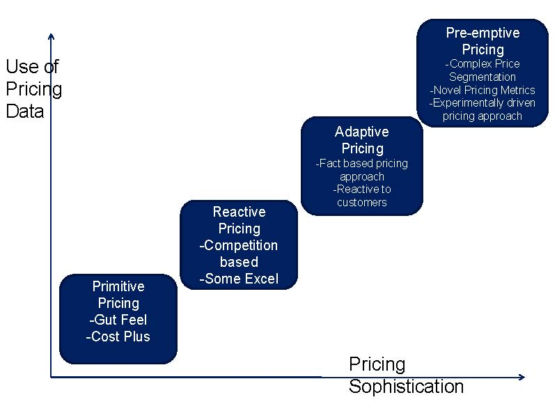
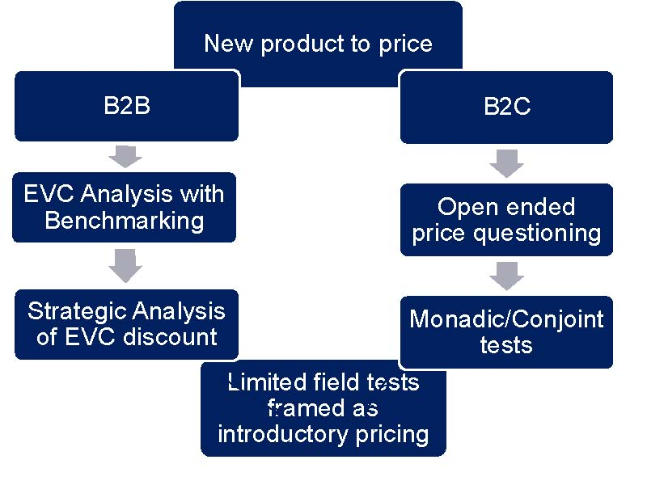
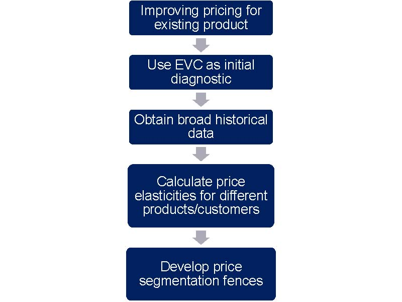

# SUMMARIZING PRICING 

## 1.PRICING AIM 

Figure 1. A taxonomy of pricing strategies 

## 2.PRCING MENU

Figure 2. Pricing a new product 

Figure 3. Pricing an existing product 

## 3. 10 Challenges to Pricing Intuition 

1. If we use cost-plus pricing, we will make a profit 

    - Only if you are incredibly accurate with your sales projections 

2. Our customers always prefer low prices 

    - Customers will always say they like lower prices. However, in many markets price serves as a guide to quality, and pricing too low can send out a negative signal. 

3. Our customers do not know prices, so our pricing strategy is unimportant. 

    - Lack of customer price knowledge makes how you present the price even more important. This is where strategies such as good-betterbest and price ending cues are key. 

4. Simpler pricing structures are better. 

    - You always want three prices. Simplifying pricing structures means giving away money. Due to the taxi-meter effect, customers may not always appreciate it when firms do price simply. 

5. If we are profitable, we do not need to price-discriminate. 

    - On the contrary: Price segmentation is actually going to be most effective for already-profitable firms, because effective segmentation requires the market power implied by profitability. 

6. Razor Blade pricing works because our customers are stupid 

    - Razor blade pricing works because it is actually subtle price segmentation. High-value, high-usage customers pay more. Low-value, low-usage customers pay less. 

7. Our product has network effects, so we need to set a low price 

    - Your product may well not have network effects at all. 

    - Even when a product has network effects, price segmentation is key. The crucial questions for network goods are: Whom do I set a low price to and whom do I set a high price to? 

8. Firms need to adjust prices until I fill capacity. 

    - It can be more profitable to have unused inventory or capacity. 

9. Industries need to work together to ensure that they avoid harmful price wars 

    - Statements like this lead to jail time. It is the responsibility of the firm, and the firm alone, to avoid a price war. 

10. Our competitors understand our pricing strategy 

    - Firms have to actively manage perceptions of their pricing by competitors, regulators and other stakeholders. 